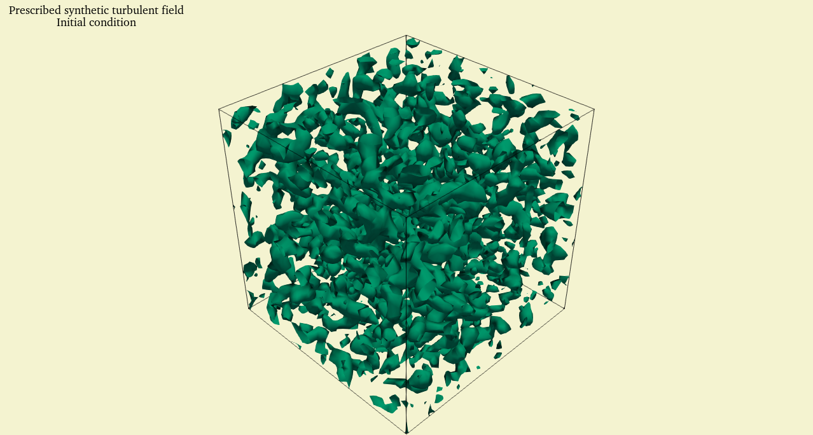
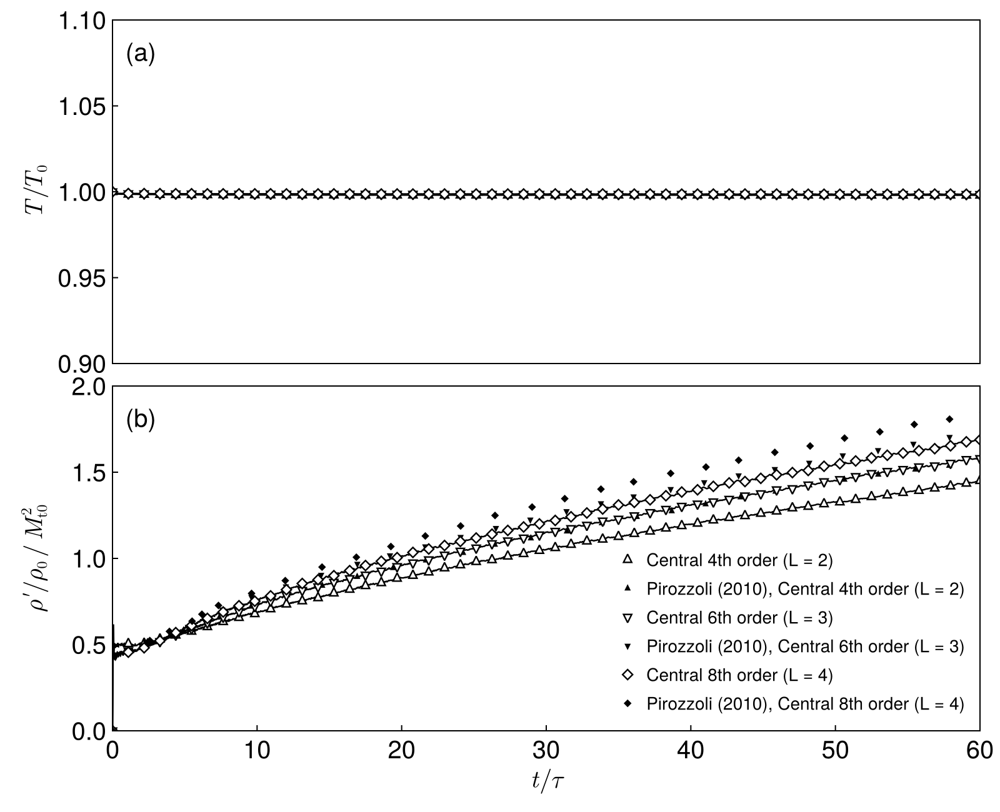
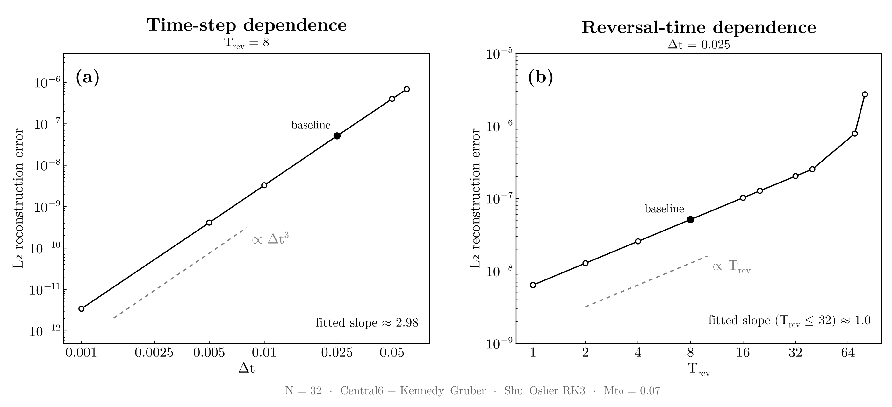

# ERT3D — Euler Reversibility Testbench, 3D

[](https://julialang.org/)

**ERT3D is a 3D compressible Euler solver written in Julia for studying numerical time reversibility and the effects of spatial and temporal discretization.**

The project was developed from scratch as a way to study the numerical methods behind compressible CFD while also learning how to structure and optimize a scientific computing code.

The main benchmark is the **three-dimensional inviscid Taylor–Green vortex**, evolved forward in time, reversed by changing the sign of the velocity field, and then integrated backward. In the continuous Euler equations, this process should recover the initial condition. The deviation from the initial state provides a measure of the numerical reversibility error.

The benchmark follows the approach of Duponcheel, Orlandi & Winckelmans and was also inspired by a CFD ParSchool lecture by Prof. Sergio Pirozzoli.

Yes — exactly. Then the Quick Start should be **minimal and reflect the actual way you run the experiments**:


## Quick Start

### Requirements

- Julia 1.12 or later

### Setup

From the repository root, start Julia with the project environment:

```bash
julia --project=.
````

Instantiate the dependencies once:

```julia
using Pkg
Pkg.instantiate()
```

### Run

Experiments and post-processing scripts can then be executed directly from the Julia REPL:

```julia
include("scripts/02_reversibility_run.jl")
```

See [`scripts/`](scripts/) for the available experiment scripts.

## Overview

The compressible Euler equations can be written as

$$
\frac{\partial Q}{\partial t} + \nabla \cdot F(Q) = 0.
$$

Under time reversal,

$$
t \rightarrow -t,
\qquad
\mathbf{u} \rightarrow -\mathbf{u},
$$

the continuous equations are formally reversible.

A discrete numerical method does not necessarily preserve this property. ERT3D provides a controlled framework for investigating how numerical choices affect the resulting reversibility error.

The current framework allows the spatial and temporal discretizations to be changed independently.

```text
                         ERT3D
                           │
              ┌────────────┴────────────┐
              │                         │
      Spatial discretization     Time integration
              │                         │
       DerivativeOperator          TimeIntegrator
              │                         │
        Convective scheme               │
              │                         │
              └────────────┬────────────┘
                           │
                         State
                           │
                    Euler equations
````

---

## Numerical methods

### Spatial discretization

ERT3D currently includes central finite-difference derivative operators of:

* 4th order
* 6th order
* 8th order

The convective terms can be evaluated using:

* **Direct formulation** — direct application of the derivative operators to the governing equations.
* **Feiereisen split form (FR-SF)**
* **Kennedy–Gruber split form (KG-SF)**

The spatial formulation is separated from the derivative operator so that different numerical choices can be tested without changing the rest of the solver.

### Time integration

The current production simulations use the **third-order Shu–Osher Runge–Kutta scheme (RK3)**.

A **self-adjoint implicit midpoint integrator** is planned as a further test of time reversibility.

---

# Results

## 1. Derivative verification

The finite-difference derivative operators are first verified using manufactured solutions.

The observed convergence rates agree with the corresponding theoretical orders for the 4th-, 6th- and 8th-order central schemes.

See:

```text
figures/derivative_convergence.png
```

---

## 2. Synthetic turbulence initial condition

ERT3D includes a synthetic isotropic turbulence initial condition used for the compressible turbulence benchmark.

The initialization is checked for:

* zero mean velocity
* prescribed RMS velocity
* divergence-free velocity field
* thermodynamic consistency
* target energy spectrum

An example of the generated initial field is shown below.



---

## 3. Pirozzoli compressible turbulence benchmark

The compressible solver was tested using the unforced isotropic turbulence case presented by **Pirozzoli (2010)**.

The comparison is particularly useful because both calculations use the **Kennedy–Gruber split form**, but discretize it differently.

ERT3D uses the **direct D-KG-SF formulation**, where standard central-difference operators are applied directly to the split terms.

Pirozzoli's reference calculation uses the **locally conservative C-KG-SF formulation**, in which the split derivatives are recast in terms of numerical fluxes.

The comparison therefore tests whether the simpler direct discretization reproduces the main behaviour of the published reference calculation.

The resulting kinetic-energy and density-fluctuation histories show **qualitative agreement with the reference results**, while also revealing differences between the two formulations.



Reference:

> Pirozzoli, S.
> *Generalized conservative approximations of split convective derivative operators.*
> Journal of Computational Physics, 229 (2010), 7180–7190.

---

## 4. Euler time-reversibility benchmark

The main experiment follows the forward/backward Taylor–Green vortex procedure:

```text
Initial Taylor–Green vortex
            │
            ▼
    Forward integration
            │
            ▼
   Small-scale structures
            │
            ▼
       Reverse velocity
            │
            ▼
   Backward integration
            │
            ▼
    Reconstructed state
            │
            ▼
     Reversibility error
```

The reconstruction error is measured between the final state and the original initial condition.

For the current reversibility studies, ERT3D uses:

* $32^3$ grid
* 6th-order central differences
* Kennedy–Gruber split form
* third-order Runge–Kutta time integration

### Time-step dependence

The reconstruction error follows approximately

$$
\epsilon \propto \Delta t^3,
$$

with a fitted slope of approximately **2.98**, consistent with the third-order RK scheme.

### Dependence on reversal time

The reconstruction error grows approximately **linearly with the reversal time** up to

$$
T_{\mathrm{rev}} \approx 32,
$$

after which the growth becomes faster.



These results are consistent with the conclusions of Duponcheel, Orlandi & Winckelmans that the accuracy of the time-stepping scheme is a key factor in numerical time reversibility.

A visualization of the complete forward → breakdown → reversal → reconstruction process is available in:

```text
data/processed/reversibility/
```

---

# Performance

A substantial part of the implementation work focused on the efficiency of the serial solver.

This included:

* profiling numerical kernels
* reducing unnecessary allocations
* reusing solver workspace
* separating numerical components to simplify benchmarking
* comparing the computational cost of different spatial formulations

ERT3D is currently a **serial CPU implementation**. Parallel execution through MPI, OpenMP or GPU frameworks is outside the current scope.

---

# Project structure

```text
src/
├── ERT3D.jl                     # Module entry point
├── parameters.jl                # Physical and numerical parameters
├── grid.jl                      # Computational grid
├── state.jl                     # Conserved and primitive states
├── physics.jl                   # Euler physics and variable conversions
├── workspace.jl                 # Reusable solver workspaces
├── simulation.jl                # Simulation orchestration
├── experiment.jl                # Experiment configuration
├── metrics.jl                   # Diagnostics and error metrics
├── io.jl                        # JLD2 / VTK output
│
├── derivatives/
│   ├── abstract.jl              # Derivative interface
│   └── central.jl               # Central finite differences
│
├── schemes/
│   ├── abstract.jl              # Convective-scheme interface
│   ├── Direct.jl                # Direct formulation
│   ├── Feiereisen.jl            # Feiereisen split form
│   └── KennedyGruber.jl         # Kennedy–Gruber split form
│
├── integrators/
│   ├── abstract.jl              # Time-integrator interface
│   └── explicit_rk3.jl          # Shu–Osher RK3
│
└── initial_conditions/
    ├── abstract.jl              # Initial-condition interface
    ├── taylor_green.jl          # Taylor–Green vortex
    └── synthetic_turbulence.jl  # Synthetic turbulence

test/
├── derivatives/
├── initialization/
├── integrators/
└── scheme/

data/
├── raw/                         # Simulation output
├── processed/                   # Figures and visualizations
└── reference/                   # Reference / digitized data


scripts/                         # Reproducible simulations and plotting
```

---

# Running a simulation

A typical simulation is assembled by selecting the grid, physical parameters, derivative operator, convective scheme and time integrator.

```julia
using ERT3D

N = 64

grid = Grid(N)

params = Parameters(
    gamma = 1.4,
    Mt0 = 0.07,
    k0 = 6.0
)

derivative = Central6(grid)
scheme     = KennedyGruber()
integrator = ExplicitRK3()

state = State(grid)
initialize!(state, TaylorGreen(), grid, params)

workspace = RK3Workspace(grid)

sim = Simulation(
    state = state,
    grid = grid,
    params = params,
    derivative = derivative,
    scheme = scheme,
    integrator = integrator,
    workspace = workspace,
)

run!(sim, 8.0; dt = 0.025, verbose = true)
```

The complete benchmark configurations and plotting utilities are available in [`scripts/`](scripts/).

---

# Reversibility benchmark

The reversibility experiment consists of:

1. Initializing the Taylor–Green vortex.
2. Integrating the Euler equations forward to a prescribed reversal time.
3. Reversing the velocity field.
4. Continuing the integration for the same amount of time.
5. Comparing the final state with the original initial condition.

The reversibility error is evaluated over the conserved variables

$$
Q =
\left(
\rho,\,
\rho u,\,
\rho v,\,
\rho w,\,
\rho E
\right).
$$

This provides a common basis for comparing different spatial and temporal discretizations.

---

# Reproducibility

Simulation data, processed results and reference data are kept separately:

```text
data/
├── raw/
├── processed/
└── reference/
```

The figures in this README are generated from ERT3D simulation data. Reference data are included separately where published results are used for comparison.

---

# References

### Pirozzoli (2010)

S. Pirozzoli,
**Generalized conservative approximations of split convective derivative operators**,
*Journal of Computational Physics*, 229 (2010), 7180–7190.

### Duponcheel, Orlandi & Winckelmans (2008)

M. Duponcheel, P. Orlandi, G. Winckelmans,
**Time-reversibility of the Euler equations as a benchmark for energy conserving schemes**,
*Journal of Computational Physics*, 227 (2008), 8736–8752.

### Brachet et al. (1983)

M. E. Brachet et al.,
**Small-scale structure of the Taylor–Green vortex**,
*Journal of Fluid Mechanics*, 130 (1983), 411–452.

### Honein & Moin (2004)

A. E. Honein, P. Moin,
**Higher entropy conservation and numerical stability of compressible turbulence simulations**,
*Journal of Computational Physics*, 201 (2004), 531–545.

---

# License

MIT — see [`LICENSE`](LICENSE).

